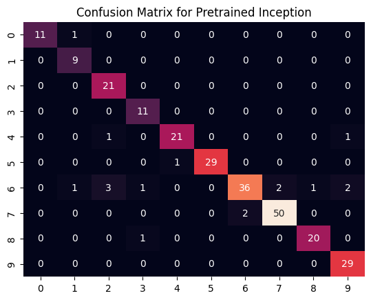
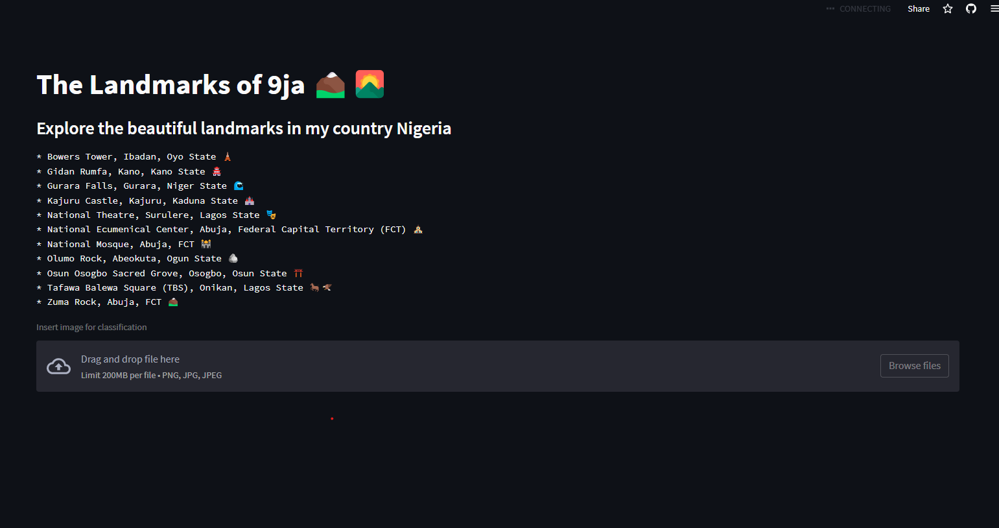

# The Landmarks of 9ja

[Check it Out!](https://eyes-of-landmarks.streamlit.app/Nigeria-Landmarks)
___
The aim of this project is to build an application that can classify eleven (11) popular natural & architectural landmarks that are in Nigeria. These landmarks include

* Bowers Tower, Ibadan, Oyo State

    *    

 

* Gidan Rumfa, Kano, Kano State

    *    

 

* Gurara Falls, Gurara, Niger State
    *    

 

* Kajuru Castle, Kajuru, Kaduna State

    *    

 

* National Theatre, Surulere, Lagos State

    *    

 

* National Ecumenical Center, Abuja, Federal Capital Territory (FCT)

    *    

 

* National Mosque, Abuja, FCT

    *    

 

* Olumo Rock, Abeokuta, Ogun State

    *    

 

* Osun Osogbo Sacred Grove, Osogbo, Osun State

    *    

 

* Tafawa Balewa Square (TBS), Onikan, Lagos State

    *    

 

* Zuma Rock, Abuja, FCT

    *    

___
The data was scraped using the [Google Image Scraper](https://github.com/ohyicong/Google-Image-Scraper) tool to extract all the images from Google

___

* Extracted the data 

* Arranged and label the data

* Performed various Data Preprocessing techniques such as converting images into tensors and feature normalization/scaling

* Convolutional Neural Networks (CNN) using Data Augmentation and Transfer Learning / Pretrained Model to achieved best performance

* **Tuned Inception V3** achieved best performance with **84% training accuracy** and **93.3% test accuracy**

___
## Model Performamce
Accuracy with Confusion Matrix was used to evaluate performance. 

* **Tuned Inception V3 with Data Augmentation**
    * Training Accuracy : 84%
    * Testing Accuracy : 93.3%
    * Confusion Matrix
    
___
## Model Deployment
The final model with the best score was deployed on a web application built with **Streamlit**

___ 
